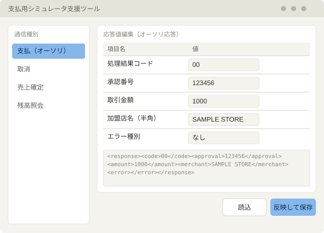
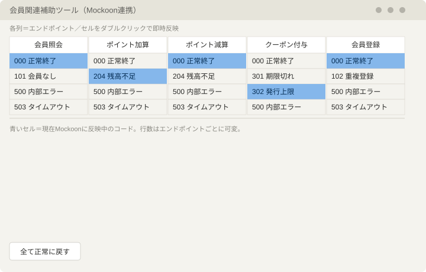
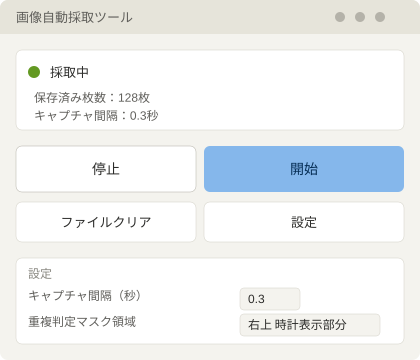
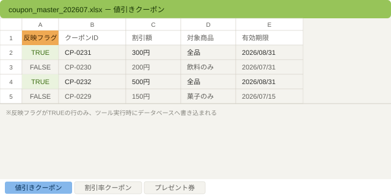
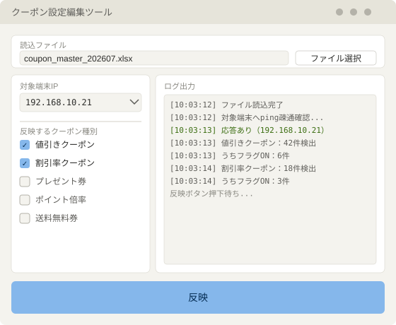

# ツール開発

過去最大規模の他社リプレース案件において、進行の途中で結合テスト予算が削減される事態が発生。
管理者も報告資料の作成などの別作業が発生し、フォローも手薄な状況だった。  
「このままでは現場が疲弊する」という判断のもと、指示を待たず、低コストで実装可能なツールを以下の通り自主的に作成した。

## 支払用シミュレータ支援ツール

※詳細は社外秘のため、画面はイメージです。

### 前提
ある支払方法のテスト実施のため、外部サーバとの通信シミュレータが提供された。
シミュレータは起動すると待機する簡単な作りになっており、応答値をxmlファイルで編集する作りになっていた（リアルタイム反映）

### Before（課題）
提供されたシミュレータは、設定値がタグで分類がされておらず、設定項目がバイト数で区切られているだけで、どの位置になにをセットすべきかをを人間が読み解く必要があった。

試験担当者が3人以上になり、かつ2人が不慣れな評価者だったため、上記仕様を共有すると、工数が嵩むことが心配された。

### After（解決後の状態）
問題は、xmlの編集が人間にとってしづらいということだけなので、
通信仕様書をもとに、xml編集用のUIを提供した。
バイト区切り・タグなしの生xmlを直接読み解く必要がなくなり、不慣れな評価者を含めたメンバーでも、UI上で値を編集するだけで試験を進められる状態になった。

### 設計判断
実装のコンパクトさを重視し、tkinterで作成。
制作は1日弱でバイブコーディングで一気に仕上げた。

### 使用技術
Python, tkinter

---

## 会員関連補助ツール

※詳細は社外秘のため、画面はイメージです。

### 前提
会員機能のテストのために、外部会員サーバをシミュレートする「Mockoon」というAPIシミュレータが提供された。
会員が絡んだ取引は、会員登録からはじまり、支払が終わるまでに外部会員サーバと複数回通信をする仕組みとなっていた。
テスト内容は、この通信の結果コードの組み合わせ（成功・失敗・エラーの種類など）次第でPOSの動作が変わることを確認する試験が主だった。

### Before（課題）
Mockoonは、通信のたびに返す結果コード（成功・失敗・エラーの種類など）を、あらかじめ設定ファイルに書き込んでおく作りになっていた。そのため、試験パターンを切り替えるたびに、設定ファイルを都度書き換える必要があった。

試験数・切替の数がかなり多く、手作業での書き換えではミスが起こることが、過去の経験から予測された。ベテラン二人に試験を担当してもらう予定だったが、二人とも同じ懸念を口にしていた。

### After（解決後の状態）
Mockoon側にグローバル変数変更用のエンドポイントを設け、UIから変更できるようにした。
各エンドポイントに対し、結果コード一覧を並べ、ダブルクリックで即時反映とする形にしたことで、切替のたびに個別のファイルやエンドポイント設定を手作業で書き換える必要がなくなった。

### 設計判断
Mockoonの仕様を調べたところ、バージョンを上げると、
・グローバル変数を利用できること
・外部からAPIを叩いて、グローバル変数を変更できること
の2点がわかった。この仕様を踏まえ、バージョンを上げる許可を取り、UI経由でグローバル変数を書き換える設計にした。

結果コード一覧の表示方法は、ドロップダウンではなくダブルクリック方式を採用。すべてのコードが見えるようにしておき、ダブルクリックで反映する方が、見栄えは悪いが、直観性とスピードが得られると考えたため。

API通信は既存のFlaskツールで実装していたため、新規ツールではなく既存ツールの機能拡張という形で実装した。

### 使用技術
Python, Flask, Mockoon

---

## 画像自動採取ツール

※詳細は社外秘のため、画面はイメージです。

### 前提
支払用の端末を新しいモデルに入れ替える計画が急遽アナウンスされた。リリースまで残り2ヶ月というタイミングだった。端末の仕様は変わらない想定だったが、最低限の比較試験として、旧端末・新端末それぞれの画面や印字・出力内容を見比べる試験を行うことになった。

### Before（課題）
電子マネー決済などでは、コンマ以下のタイミングでカードをかざすといった、シビアな操作が必要な場面がある。この試験では、画面のスクリーンショットを証拠として残す作業と、その内容が正しいかを確認する作業の両方を、人が同時にこなす必要があった。

操作に集中していると撮り忘れが起きたり、逆に撮ることに気を取られると操作を誤ったりと、どちらも人任せにすると事故が起きやすい組み合わせだった。

### After（解決後の状態）
問題は、操作と撮影・確認を人間が同時にこなさなければならないことだったので、画面キャプチャを自動で行うツールを作り、操作と確認の作業を分離できるようにした。
人は操作そのものに集中でき、確認は後からまとめて行えるようになった。

### 設計判断
社内で使われていたスクリーンショットツールがあるが、キーを押すたびに1枚ファイルを作る単純な作りだった。キーを機械的に連打させれば自動化できるかとも考えたが、キー押下から実際にファイルが生成されるまではタイムラグがあり、コマ落ちが発生する。

このことは、以前作った別のツールの経験からわかっていたため、以下の作りにした。

1. 指定した秒数ごとに画面をキャプチャし、いったんメモリ上に保持する
2. メモリ上の画像を、一定時間経過したらファイルとして書き出す。この処理は、キャプチャとは別のスレッドで並行して行う（スレッドを分けないと、連打するときと同様に、コマ落ちが発生しやすい）
3. 保存時には、前の画像と比較し、一致すれば保存をスキップする（重複判定）

運用してみると、時計の秒針表示やインジケータの点滅などの、本質的でない変化のせいで「重複」と判定されず、不要な画像が量産される問題が見つかった。そのため、比較する際にあらかじめ指定した領域を黒く塗りつぶしてから比較するよう修正した。

ユーザーが操作する画面は、開始・停止・ファイルのクリア・設定の4つのみとし、誰でも迷わず使えるシンプルな作りにした。

### 使用技術
Python, マルチスレッド処理

---

## クーポン設定編集ツール

※詳細は社外秘のため、画面はイメージです。

### 前提
今回担当したユーザ様は、クーポンの種類が多く、種類ごとにデータベースのテーブルを用意し、それぞれに設定値を登録する必要があった。将来的にはサーバ経由で設定できるようになる予定だったが、テストフェーズの時点ではそのサーバがまだ実装されていなかった。

### Before（課題）
サーバがない状態でも設定値をデータベースに登録する手段が必要だった。加えて、クーポン機能のリリースが遅れたことで、本来一人で担当する予定だった作業を、データベースの扱いに不慣れなメンバー二人を含む3人で分担せざるを得なくなった。難易度の高い作業を、経験の異なるメンバー間でどう分担するかが課題だった。

### After（解決後の状態）
問題は、データベースを直接触れないメンバーでも設定できる手段が必要、ということだったので、社内で使い慣れているExcelを入力窓口にし、そこからデータベースへ反映するツールを作った。
データベースの知識がなくても、Excelに値を入力するだけでクーポン設定の作業に参加できるようになった。

### 設計判断
クーポンの設定内容はExcelで管理する形にし、シートごとにテーブルを分割して設定値を記載できるようにした。一番左の列に「反映フラグ」を用意し、フラグがONになっている行だけを書き込み対象とすることで、意図しない上書きを防ぐ仕組みにした。

このExcelファイルを読み込み、データベースに書き込むための操作画面はtkinterで別途用意した（Excelファイルの読込ボタン、対象テーブルの選択、書き込み先の端末IPアドレスの指定）。

ファイルの読み書きにはopenpyxlを使用したため、Excelを開いたままの状態でもツールを実行でき、設定内容を見ながらそのまま反映作業に移れる、スムーズな運用が可能になった。

※端末に対して、pingの疎通チェックなども行うので、Excelが固まる、などの問題も回避できる

### 使用技術
Python, tkinter, openpyxl, Excel
