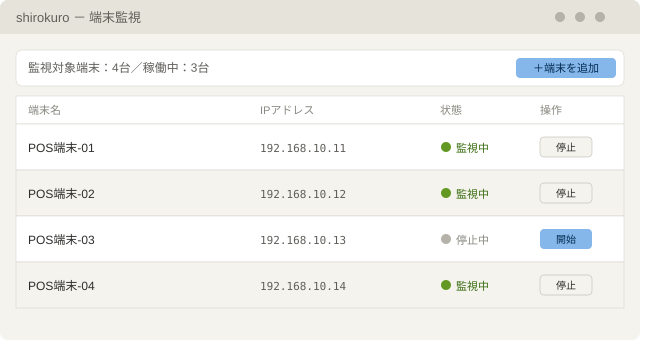
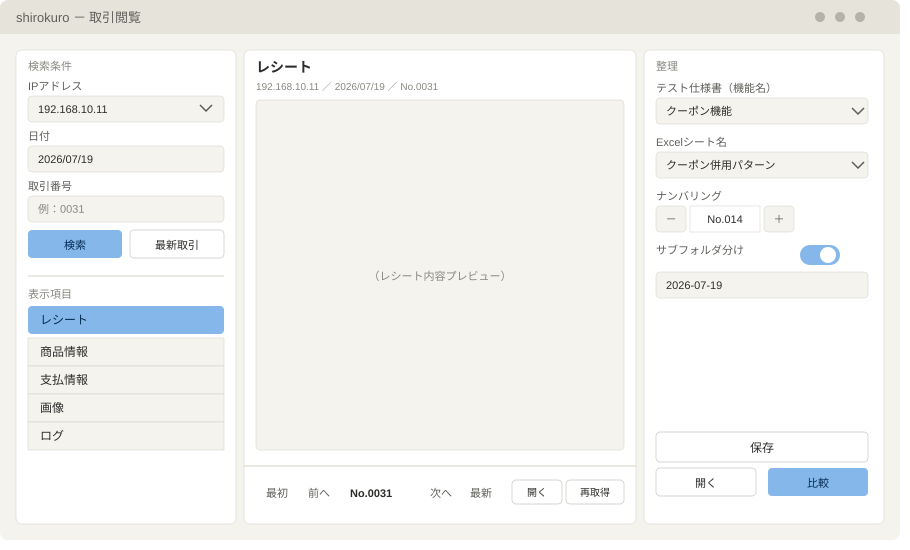
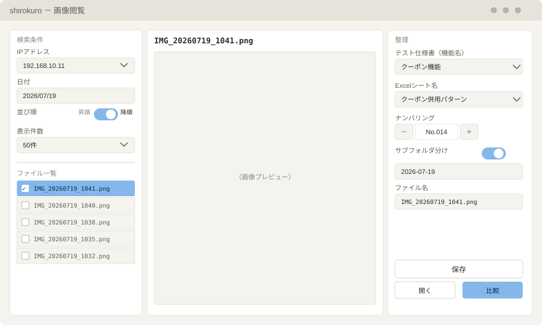

# 内製ツール開発の概要（Shirokuro）

## 概要
QA業務において、必要なデータ（取引・画像・ログ）の採取と整理を自動化する社内ツールを、個人で企画・開発・運用した。それまで手作業だった一連の工程を大幅に効率化し、運用として定着させたもの。

## 背景にあった課題
手作業でのデータ採取には、採取漏れ、命名・格納ルールの不統一、メンバー交代のたびに指導が必要になる引き継ぎコスト、閲覧用のExcelマクロが重く不安定、といった課題があった。これらを改善するために、ツールの開発を始めた。

## 取り組み
社内で利用が許可されているソフトウェアの範囲からFlask + Bootstrapを選定し、開発補助としてChatGPTの利用も申請・承認を得たうえで進めた。実務の裏で調査・開発・リファクタリングを重ね、約1年かけて構築、長期プロジェクトで約1年運用・改善した。

## 成果
- 約2時間/人日の作業コストを削減（従来の手作業・旧ツール利用時との比較）。
- 加えて、閲覧・比較にかかるコストが大きく下がったことで、閲覧・比較を行う回数そのものが増加。単なる効率化にとどまらず、業務の質の向上にも寄与した。

## 主な機能
### 端末監視

※詳細は社外秘のため、画面はイメージです。

ローカルネットワーク上の指定した端末を定期的に監視し、新たに取引データが作成されたら自動的に採取する。取引に付随するログやスクリーンショットも同時に採取し、対象は設定画面から追加・選択できるようにした。

### 取引閲覧

※詳細は社外秘のため、画面はイメージです。

自動採取したデータを閲覧するための画面。取引データは複数のファイルから構成されており、プレーンなテキスト、csv、xml形式がある。これらのファイルをそのまま表示、または日本語ラベルを付与して整形したものを表示する。左ペインで取引を検索し、中央ペインにプレビュー表示する。

### 画像閲覧

※詳細は社外秘のため、画面はイメージです。

端末上に保存したスクリーンショットをリアルタイムで閲覧するための機能。取引と同時にスクリーンショットは保存されるが、取引データとしてではなく、画面の表示確認をする際に特化した機能を別途用意している。

## 技術スタック
Python / Flask / pandas / openpyxl / xlwings（既存の比較ツールのマクロを軽量化し、実行する際に使用）、Bootstrap / JavaScript

## 現在
この経験を土台に、FastAPI + TypeScriptで公開用に一部機能を切り取り、再設計を進めている。
